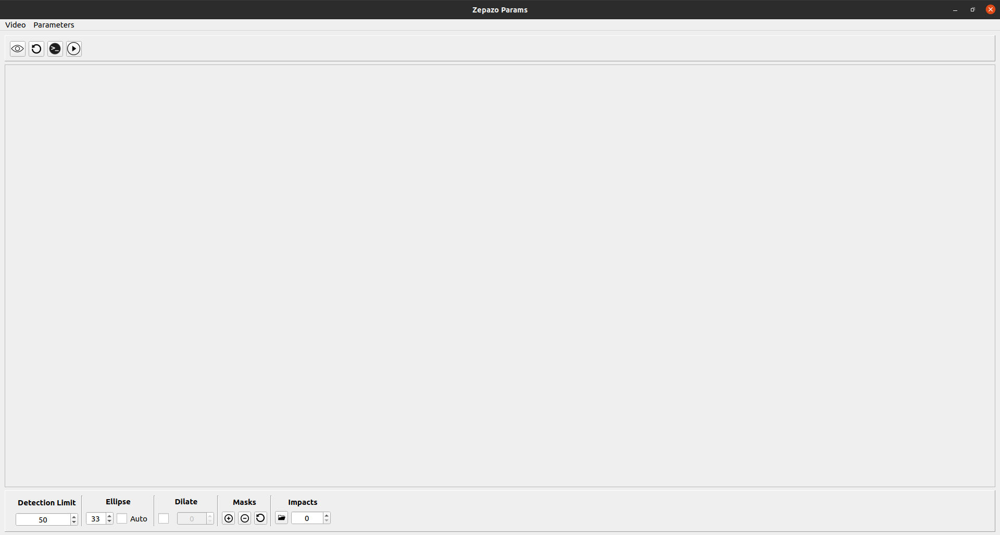
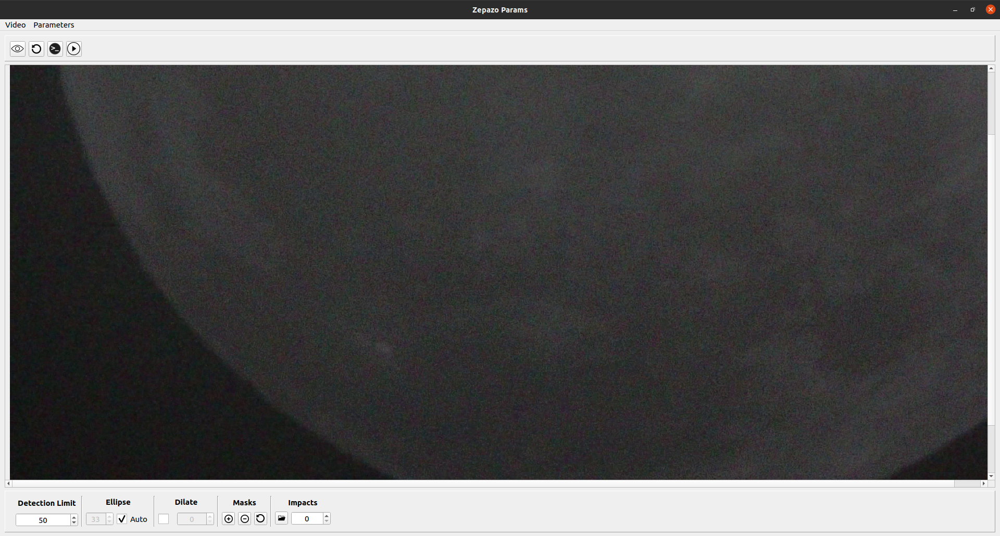
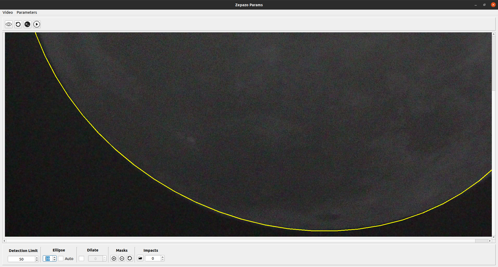
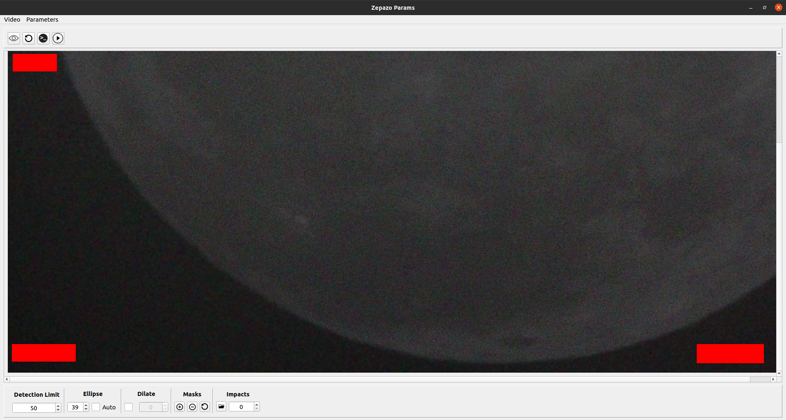
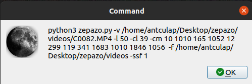

# Zepazo :waning_crescent_moon:

## Description :collision:
Zepazo is a project that aims to facilitate the detection of lunar impacts in videos taken from telescopes and standard cameras by comparing the different frames of the videos, trying to minimize false positives as much as possible.

## Motivation :star:
This project originally arises for the completion of a Final Degree Project proposed by [Sergio Alonso Burgos](https://lsi.ugr.es/lsi/zerjioi) and is being carried out by [Antonio Cuadros Lapresta](https://github.com/antoniocuadros) with the help of Sergio with the aim of facilitating the detection of lunar impacts due to our great love for the astronomy. It is intended to carry out the implementation of a novel software due at present we have no record of such software exists and which will facilitate the work of astronomers.
# Zepazo User's Manual (English)
Zepazo is a set of tools (programs) that aims to provide an automated solution for the detection of impacts through the analysis of recordings of dark areas of the Moon. In order to facilitate this task for the user, four programs are proposed:

- __zepazo__: Main program in charge of the analysis of the recordings.
- __zepazoParams__: Program that provides a simple interface for assisted parameter setting.
- __zepazoVerify__: Program in charge of verifying / validating the impacts of two recordings in order to find impacts at similar moments in time and validate them.
- __zepazoCrop__: Program that aims to provide a video cropping tool with the aim of not having to download the complete videos from the server to adjust the parameters using the ZepazoParams program.

## Installing Zepazo
To install the set of programs we simply have to have Poetry installed, which can be installed as follows:
```
pip install poetry
```

Once poetry is installed we can install all the dependencies of our program simply by executing:

```
poetry install
```

__Note__: If when executing the ZepazoParams program a PyQt compatibility error with OpenCv is obtained, we must download the OpenCv version as follows:

```
pip install opencv-python==4.3.0.36
```

## Zepazo
It is the main program whose objective is to analyze a video given by a user in search of the possible impacts that may have taken place during the recording.


This program runs as follows:

```
python3 src/zepazo.py [argument list]
```

And we have the following list of arguments to adjust the analysis process:

| Abbreviation |   Entire  |   Utility  | Type | Obligatoriness | Example | Default value |
|---|---|---|---|---|---|---|
|-h| --help|Parameter help. The possible parameters that the program can use are shown| |Optional| python3 src/zepazo.py -h| |
|-v|--video|Path of the video to be analyzed.| String|Mandatory| python3 src/zepazo.py -v "/home/user/video_path"| |
|-d|--debug|Show a simulation of the analysis process with the indicated parameters, the possible impacts detected are not saved| | Optional | python3 src/zepazo.py -d | |
|-cm|--coordinatesmask| List of points indicating the coordinates of the masks to add. Every two elements of the list will indicate a mask, in this way, the first element of each pair of coordinates will be the upper left corner of the rectangle and the second will be the lower right corner.| Integer list. | Optional | python3 src/zepazo.py -cm 1 2 3 4 | |
| -l | --detectionlimit | Impact detection index, this value depends on the brightness of the input video|Positive integer|Optional|python3 src/zepazo.py -l 30|50|
|-cl|--circlelimit|Value used to fit the ellipse to the lunar contour, if the argument is not set, a default value will be calculated|Positive integer|Optional| python3 src/zepazo.py -cl 17 |Dynamically calculated|
|-f|--folder| Folder path where to store the frames of the detected impacts|String|Optional|python3 src/zepazo.py -f "/home/user/path_to_folder"|Video location|
|-ssf|--saveSurroundingFrames|Number of frames before and after the impact to be stored, by default only the impact frame is stored.| Positive integer | Optional | python3 src/zepazo.py -ssf 2 | 0 |
|-dt|--dilate|Kernel value to be used to dilate the previous frames and avoid false positives derived from movement and luminous areas of the moon|Positive integer| Opcional|python3 src/zepazo.py -dt 3|0|
|-cf| --configFile|Path of a configuration file generated by ZepazoParams to import parameter values. |String. | Optional | python3 src/zepazo.py -cf "/home/user/path_to_save" | Video location |
|-sf| --startingFrame|Frame number from which to start the analysis|  Positive integer | Optional | python3 src/zepazo.py -sf 122 | 0 |
|-ef| --endingFrame|Frame number up to which to analyze |  Positive integer | Optional |python3 src/zepazo.py -ef 600 | Last frame |

Once the arguments have been adjusted, the analysis will begin and once it is finished we will obtain in the folder selected by arguments the frames a possible impact has been detected as well as a log file that summarizes the possible impacts found after the analysis performed.

## ZepazoParams
This program aims to help the user to adjust the values of the parameters to be used in the 'zepazo' program through a simple interface.

This program runs as follows:

```
python3 src/Interface/zepazo_params.py
```

And when executing the above, the interface opens:



First of all, in order to start adjusting parameters, the user must select a video using the upper left menu 'Video' and selecting the option 'Open File' to choose a video. Once a video has been chosen, the first frame of it will be displayed in the central part of the interface:




Once the video has been selected and we have an image of the video on the screen, we can start adjusting parameters as follows (lower menu):

- __Detection Limit__: By default it presents the value of 50 and for videos with normal conditions it should not vary much, however it can be increased or decreased and by pressing the button on the right with the 'play' symbol on the top bar we will be able to see how changing said value.
- __Ellipse__: As for the ellipse that covers the lunar surface, the 'auto' option is activated by default, which automatically tries to obtain a good estimate. However, you can uncheck this box and adjust manually by using the numeric box. Example:

- __Dilate__: In this section we can choose whether or not we want to dilate the frames of our video, it is advisable to activate this option when illuminated areas appear on the lunar surface in our video. If activated, you can choose the dilation value in the numeric box and see a preview using the 'play' button.
- __Masks__: This section allows us to add masks, delete or restore all of them. For example we could add the following masks:

- __Impacts__: This section allows us to choose both the folder where to save the impacts and additionally choose the number of previous and subsequent impacts to save when an impact is detected.


As for the top menu, we find the following options (from left to right):
- __Display all parameters__: This button that has the icon of an eye, allows us to see both the masks and the ellipse applied at the same time since, as we have seen previously, when masks are chosen only the masks are seen and when the value of the ellipse is chosen only you can see the ellipse, in this case it allows you to see everything together.
- __Reset all__: This second upper button resets all the modified parameters to the default values.
- __Command Button__: By pressing this button we obtain the complete command with the selected parameters to launch the analysis with the chosen values as well as copy it to the clipboard. An example is the following:

- __Preview button__: This button allows launching the analysis process in debug mode to check if the values chosen for the parameters are correct or not.


Additionally, in the top menu called 'Parameters' we will find the option to export parameters to JSON or import from JSON..

## ZepazoVerify
This program aims, after analyzing two videos that have been recorded at similar times with the Zepazo program, to collect the logs in order to identify if there is any temporal relationship between the impacts of the first video and those of the second in terms of whether they occur in the same instant.

This program runs as follows:

```
python3 src/zepazoVerify.py [argument list]
```

And we have the following list of arguments to adjust the validation process:

| Abbreviation |   Entire  |   Utility  | Type | Obligatoriness |
|---|---|---|---|---|
|-lgf1|--logFile1|Log result of the analysis of the first video|String|Mandatory|
|-lgf2| --logFile2|Log result of the analysis of the second video|String|Mandatory|
|-rlfg| --resultingLogFile|Path where to save the resulting log|String|Mandatory|
|-mt|--marginTime|Time margin for two impacts with a difference indicated by this parameter to be matched|Positive integer|Mandatory|

In this way, if we execute the command: 

```
python3 src/zepazoVerify.py -lgf1 "/home/user/logs/log1.json" -lgf2 "/home/user/logs/log2.json" -rlfg "/home/user/logs/log_verify.json" -mt 10 
```

We would be trying to validate the impacts of the video that log1 has generated with those of the video that log2 has generated, matching them with a maximum time difference of 10 seconds and storing the result in the log_verify.json file.

The result obtained after executing this program is a file such as the following:

```
[
    {
        " difference " : 5 ,
        " log_1_impact " : 1 ,
        " log_2_impact " : 0 ,
        " path_to_log1 " : "../ test/log.json" ,
        " path_to_log2 " : "../ test/log2.json"
    }
]
```

Where we can see that an impact has been validated since the time difference has been 5 seconds, in log1 the impact has been number 1, in log2 the impact has been number 0 and additional information is provided on the location of the logs in case it is necessary to consult specific information on the matched impacts.

## ZepazoCrop

This program allows us to cut videos in order not to overload the server network, since if a user wants to download a video to use it in the zepazoParams program in order to adjust the parameters to later launch the analysis, they do not need to have the complete video, a short fragment is sufficient.

This program runs as follows:

```
python3 src/zepazoCrop.py [argument list]
```

And we have the following list of arguments to adjust the clipping process:

| Abbreviation |   Entire  |   Utility  | Type | Obligatoriness |
|---|---|---|---|---|
|-vo|--videoOriginal|Video path to crop|String|Mandatory|
|-vc|--videoCropped|Path to save the cropped video|String|Mandatory|
|-ss|--secondStart|Second from which to crop the video|Positive integer|Mandatory|
|-se|--secondEnd|Second of the video up to which to crop it|Positive integer|Mandatory|

If we execute the following command: 

```
python3 src/zepazoCrop.py -vo "/home/user/videos/video1" -vc "/home/user/videos/video1_crop" -ss 120 -se 140
```

We would be cropping the video whose name is video1 from second 120 to 140 and storing the result with the name video1_crop.

## Manual de usuario Zepazo (Spanish)
Zepazo es un conjunto de programas que pretende aportar una solución automatizada para la detección de impactos a través del análisis de grabaciones de zonas oscuras de la Luna. Con el objetivo de facilitar dicha tarea al usuario se proponen cuatro programas:

- __zepazo__: Programa principal encargado del análisis de las grabaciones.
- __zepazoParams__: Programa que aporta una sencilla interfaz para el establecimiento asistido de parámetros.
- __zepazoVerify__: Programa encargado de verificar/validar los impactos de dos grabaciones con el objetivo de encontrar impactos en momentos temporales similares y validarlos.
- __zepazoCrop__: Programa que pretende aportar una herramienta de recorte de vídeos con el objetivo de no tener que descargar los vídeos completos del servidor para ajustar los parámetros haciendo uso del programa ZepazoParams.

### Instalación del conjunto de programas
Para instalar el conjunto de programas simplemente debemos tener instalado poetry el cual se puede instalar de la siguiente forma:
```
pip install poetry
```

Una vez instalado poetry podemos instalar todas las dependencias de nuestro programa simplemente ejecutando:

```
poetry install
```

__Nota__: Si al ejecutar el programa ZepazoParams se obtiene un error de compatibilidad de PyQt con OpenCv deberemos bajar la versión de OpenCv de la siguiente forma:

```
pip install opencv-python==4.3.0.36
```

### Zepazo
Es el programa principal cuyo objetivo es analizar un vídeo dado por un usuario en busca de los posibles impactos que hayan podido tomar lugar durante dicha grabación.


Este programa se ejecuta de la siguiente forma:

```
python3 src/zepazo.py [lista de argumentos]
```

Y contamos con la siguiente lista de argumentos para ajustar el proceso de análisis:

| Abreviatura |   Completo  |   Utilidad  | Tipo | Obligatoriedad | Ejemplo | Valor por defecto |
|---|---|---|---|---|---|---|
|-h| --help|Ayuda de parámetros. Se muestran los posibles parámetros que el programa puede utilizar| |Opcional| python3 src/zepazo.py -h| |
|-v|--video|Ruta del vídeo a analizar.| Cadena de caracteres| Obligatorio| python3 src/zepazo.py -v "/home/user/video_path"| |
|-d|--debug|Mostrar una simulación del proceso de análisis con los parámetros indicados, no se guardan los posibles impactos detectados| | Opcional | python3 src/zepazo.py -d | |
|-cm|--coordinatesmask| Lista de puntos indicando las coordenadas de las máscaras a añadir. Cada dos elementos de la lista indicará una máscara, de esta forma, el primer elemento de cada par de coordenadas será la esquina superior izquierda del rectángulo y el segundo será la esquina inferior derecha.| Lista de enteros. | Opcional | python3 src/zepazo.py -cm 1 2 3 4 | |
| -l | --detectionlimit | Índice de detección de impactos, este valor depende del brillo del vídeo introducido|Entero positivo|Opcional|python3 src/zepazo.py -l 30|50|
|-cl|--circlelimit|Valor que sirve para ajustar la elipse al contorno lunar, si no se establece el argumento, se calculará un valor por defecto|Entero positivo|Opcional| python3 src/zepazo.py -cl 17 |Calculado dinámicamente|
|-f|--folder| Ruta de la carpeta donde almacenar los fotogramas de los impactos detectados|Cadena de caracteres|Opcional|python3 src/zepazo.py -f "/home/user/path_to_folder"|Ubicación del vídeo|
|-ssf|--saveSurroundingFrames|Número de fotogramas previos y posteriores al impacto  que se desean almacenar, por defecto únicamente se almacena el fotograma del impacto. | Entero positivo | Opcional | python3 src/zepazo.py -ssf 2 | 0 |
|-dt|--dilate|Valor del kernel a utilizar para dilatar los fotogramas previos y evitar  falsos positivos derivados de movimiento y zonas luminosas de la luna|Entero positivo| Opcional|python3 src/zepazo.py -dt 3|0|
|-cf| --configFile|Ruta de un archivo de configuración generado por ZepazoParams para importar valores de los parámetros. |Cadena de caracteres. | Opcional | python3 src/zepazo.py -cf "/home/user/path_to_save" | Ubicación del vídeo |
|-sf| --startingFrame|Número de fotograma desde el que comenzar el análisis |  Entero positivo | Opcional | python3 src/zepazo.py -sf 122 | 0 |
|-ef| --endingFrame|Número de fotograma hasta el que realizar el análisis |  Entero positivo | Opcional |python3 src/zepazo.py -ef 600 | Último fotograma |

Una vez ajustados los argumentos comenzará el análisis y una vez que este concluya obtendremos en la carpeta seleccionada por argumentos los fotogramas se ha detectado un posible impacto así como un archivo de log que resume los posibles impactos encontrados tras el análisis realizado.

### ZepazoParams
Este programa pretende ayudar al usuario a ajustar los valores de los parámetros que se van a utilizar en el programa 'zepazo'  a tarvés de una sencilla interfaz.

Este programa se ejecuta de la siguiente forma:

```
python3 src/Interface/zepazo_params.py
```

Y al ejecutar lo anterior se nos abre la interfaz:


En primer lugar para poder empezar a ajustar parámetros el usuario deberá seleccionar un vídeo haciendo uso del menú superior izquierdo 'Vídeo' y seleccionando la opción 'Open File' para elegir un vídeo. Una vez elegido un vídeo se mostrará el primer fotograma del mismo en la parte central de la interfaz:


Una vez el vídeo ha sido seleccionado y contamos con una imagen del vídeo en pantalla, podemos empezar a ajustar parámetros de la siguiente forma (menu inferior):

- __Índice de detección__: por defecto presenta el valor de 50 y para vídeos con condiciones normales no debería variar mucho, no obstante puede aumentarse o disminuirse y pulsando al botón de la derecha con el símbolo de 'play' de la barra superior podremos ver como afecta el cambio de dicho valor.
- __Elipse__: En cuanto a la elipse que recubre la superficie lunar, por defecto viene activada la opción 'auto' la cual intenta obtener de forma automática una buena estimación. No obstante se puede desmarcar esta casilla y ajustar manualmente mediante el uso de la casilla numérica. Un ejemplo es el siguiente:

- __Dilate__: en este apartado podemos elegir si queremos o no dilatar los fotogramas de nuestro vídeo, es recomendable activar esta opción cuando en nuestro vídeo aparecen zonas iluminadas en la superficie lunar. Si se activa se podrá elegir el valor de dilatación en la casilla numérica y ver una previsualización mediante el botón 'play'.
- __Máscaras__: Este apartado nos permite añadir máscaras, eliminar o restablecer todas. Por ejemplo podríamos añadir las siguientes máscaras:

- __Impactos__: Este apartado nos permite elegir tanto la carpeta donde guardar los impactos como adicionalmente elegir el número de impactos previos y posteriores a guardar cuando se detecta un impacto.


En cuanto al menú superior, encontramos las siguientes opciones (de izquierda a derecha):
- __Visualizar todos los parámetros__: Este botón que cuenta con el icono de un ojo, nos permite ver aplicados tanto las máscaras como la elipse al mismo tiempo ya que como hemos viso anteriormente, cuando se elijen máscaras únicamente se ven las máscaras y cuando se elije el valor de la elipse únicamente se ve la elipse, en este caso permite ver todo junto.
- __Restablecer todo__: Este segundo botón superior restablece a los valores por defecto todos los parámetros modificados.
- __Botón comando__: Al pulsar este botón obtenemos el comando completo con los parámetros seleccionados para lanzar el análisis con los valores elegidos así como se copia al clipboard. Un ejemplo es el siguiente:

- __Botón preview__: Este botón permite lanzar en modo debug el proceso de análisis para comprobar si los valores elegidos para los parámetros son correctos o no.


Adicionalmente, en el menú superior llamado 'Parameters' encontraremos la opción de exportar parámetros a JSON o importar desde JSON.

### ZepazoVerify
Este programa pretende tras analizar dos vídeos que se han grabado en instantes temporales similares con el programa Zepazo, recoger los logs con el objetivo de identificar si existe alguna relación temporal entre los impactos del primer vídeo y los del segundo en cuanto a que ocurran en el mismo instante.

Este programa se ejecuta de la siguiente forma:

```
python3 src/zepazoVerify.py [lista de argumentos]
```

Y contamos con la siguiente lista de argumentos para ajustar el proceso de validación:

| Abreviatura |   Completo  |   Utilidad  | Tipo | Obligatoriedad |
|---|---|---|---|---|
|-lgf1|--logFile1|Log resultado del análisis del primer vídeo|Cadena de caracteres|Obligatorio|
|-lgf2| --logFile2|Log resultado del análisis del segundo vídeo|Cadena de caracteres|Obligatorio|
|-rlfg| --resultingLogFile|Ruta donde guardar el log resultante|Cadena de caracteres| Obligatorio|
|-mt|--marginTime|Margen temporal para que dos impactos con una diferencia indicada por este parámetro sean emparejados|Entero positivo|Obligatorio|

De esta forma si ejecutamos el comando: 

```
python3 src/zepazoVerify.py -lgf1 "/home/user/logs/log1.json" -lgf2 "/home/user/logs/log2.json" -rlfg "/home/user/logs/log_verify.json" -mt 10 
```

Estaríamos intentando validar los impactos del vídeo que ha generado el log1 con los del vídeo que ha generado el log2 emparejando los mismos con una diferencia temporal máxima de 10 segundos y almacenando el resultado en el fichero log_verify.json.

De esta forma el resultado obtenido tras ejecutar este programa es un fichero como por ejemplo el siguiente:

```
[
    {
        " difference " : 5 ,
        " log_1_impact " : 1 ,
        " log_2_impact " : 0 ,
        " path_to_log1 " : "../ test/log.json" ,
        " path_to_log2 " : "../ test/log2.json"
    }
]
```

Donde podemos ver que se ha validado un impacto ya que la diferencia temporal ha sido de 5 segundos, en el log1 el impacto ha sido el número 1, en el log2 el impacto ha sido el número 0 y se aporta información adicional de la ubicación de los logs por si fuese necesario consultar información concreta de los impactos emparejados.

### ZepazoCrop

Este programa nos permite recortar vídeos con el objetivo de no sobrecargar la red del servidor, ya que si un usuario desea descargar un vídeo para utilizar el programa zepazoParams con el objetivo de ajustar los parámetros para posteriormente lanzar el análisis no necesita tener el vídeo completo, con un fragmento breve es suficiente.

Este programa se ejecuta de la siguiente forma:

```
python3 src/zepazoCrop.py [lista de argumentos]
```

Y contamos con la siguiente lista de argumentos para ajustar el proceso de recorte:

| Abreviatura |   Completo  |   Utilidad  | Tipo | Obligatoriedad |
|---|---|---|---|---|
|-vo|--videoOriginal|Ruta del vı́deo a recortar|Cadena de caracteres|Obligatorio|
|-vc|--videoCropped|Ruta donde guardar el vı́deo recortado|Cadena de caracteres|Obligatorio|
|-ss|--secondStart|Segundo desde el que recortar el vı́deo|Entero positivo|Obligatorio|
|-se|--secondEnd|Segundo hasta el que recortar el vı́deo|Entero positivo|Obligatorio|

De esta forma si ejecutamos el comando: 

```
python3 src/zepazoCrop.py -vo "/home/user/videos/video1" -vc "/home/user/videos/video1_crop" -ss 120 -se 140
```

Estaríamos recortando el vídeo cuyo nombre es video1 desde el segundo 120 hasta el 140 y almacenándo el resultado con el nombre video1_crop.


# Additional documentation
## Execute unit tests
`poetry run task test`

### Execute unit tests with Dockerfile
`docker build . -t zepazo`

`docker run -e DISPLAY=$DISPLAY -v /tmp/.X11-unix:/tmp/.X11-unix zepazo`